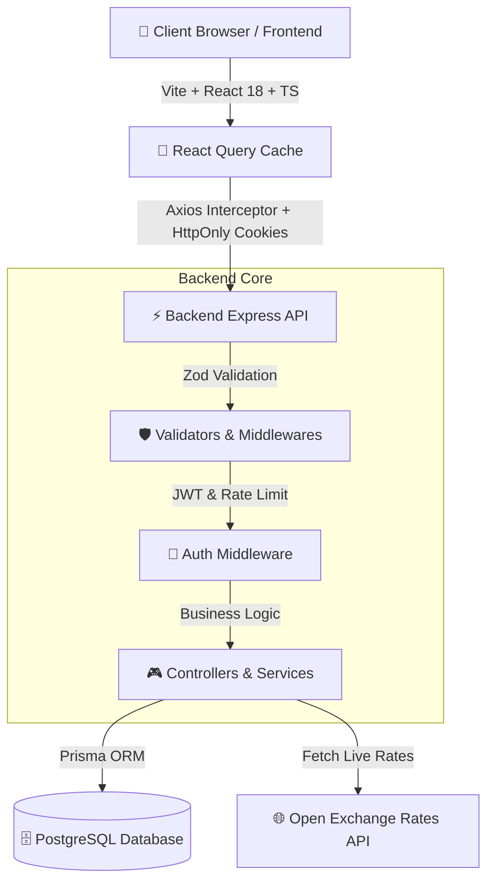

<div align="center">

  # 💸 Smart Expense Tracker — Quản Lý Tài Chính Thông Minh

  **Ứng dụng Quản lý Chi tiêu Cá nhân Hiện đại, Thông minh & Chuẩn Enterprise**

  [](https://reactjs.org/)
  [](https://www.typescriptlang.org/)
  [](https://vitejs.dev/)
  [](https://expressjs.com/)
  [](https://www.prisma.io/)
  [](https://www.postgresql.org/)
  [](https://www.docker.com/)
  [](LICENSE)

  <p align="center">
    <a href="#-tính-năng-nổi-bật">Tính Năng</a> •
    <a href="#-kiến-trúc-hệ-thống">Kiến Trúc</a> •
    <a href="#-công-nghệ-sử-dụng">Công Nghệ</a> •
    <a href="#-hướng-dẫn-cài-đặt">Cài Đặt</a> •
    <a href="#-tài-liệu-api">API Docs</a> •
    <a href="#-kiểm-thử-hiệu-năng-k6--bảo-mật--kết-quả-thực-tế">k6 Testing</a> •
    <a href="#-roadmap">Roadmap</a>
  </p>

</div>

---

## 📌 Giới Thiệu

**Smart Expense Tracker** là giải pháp quản lý tài chính cá nhân toàn diện, kết hợp trải nghiệm giao diện người dùng **Apple Human Interface (HIG)** cùng kiến trúc Backend chuẩn Enterprise. Ứng dụng giúp bạn kiểm soát dòng tiền, thiết lập ngân sách thông minh, quy đổi ngoại tệ thời gian thực và phân tích xu hướng thu chi với hiệu ứng chuyển động 60fps mượt mà.

> 🌟 **Điểm đặc biệt**: Hệ thống lưu giữ cấu hình giao diện (Theme, Currency, Language, Ngưỡng cảnh báo) vĩnh viễn trên Database Cloud — tự động khôi phục chính xác trạng thái cài đặt khi đăng nhập trên bất kỳ thiết bị nào.

---

## 🌟 Tính Năng Nổi Bật

### 📊 1. Dashboard Thống Kê Phong Cách Apple (Apple-Inspired UI)
- **Apple Month/Year Picker**: Bộ chọn thời gian dạng Modal Glassmorphism với hiệu ứng Spring Physics mềm mại (`framer-motion`), hỗ trợ cuộn chuột đổi năm và iOS Bottom Sheet trên điện thoại.
- **Rolling Number Animation (CountUp)**: Các chỉ số **Tổng thu**, **Tổng chi**, và **Số dư** tự động cuộn nhảy số mượt mà trong 700ms khi chọn tháng mới.
- **Biểu đồ Trực quan (Recharts)**: Phân tích tỷ lệ chi tiêu theo danh mục (Pie Chart) và xu hướng Thu vs Chi qua các tháng (Bar Chart).
- **Cảnh báo Ngân sách Real-Time**: Tự động phát hiện và cảnh báo các danh mục chi tiêu vượt mốc (80% / 100%).

### 💸 2. Quản Lý Giao Dịch & Mobbin UX
- **Chuyển đổi Thu / Chi (Segmented Pill Slider)**: Thanh chuyển đổi dạng Pill Slider với hiệu ứng Framer Motion mượt mà.
- **Bộ lọc danh mục Động**: Tự động lọc danh mục tương ứng với loại giao dịch (Chi tiêu hay Thu nhập).
- **Nút Lưu 3 Trạng thái (Icon-Swap)**: Nút bấm hiển thị trạng thái `Idle` ➔ `Loading` ➔ `Success Checkmark` mượt mà với bộ xử lý quá hạn mạng 8s (Safety Timeout).
- **Xuất Báo Cáo CSV**: Trích xuất dữ liệu giao dịch ra file CSV chuẩn UTF-8 (mở trực tiếp trên Excel không bị lỗi font).
- **Skeleton Shimmer Loader**: Hiển thị khung chờ mượt mà trong lúc tải dữ liệu.

### 💱 3. Bảng Tỷ Giá Hối Đoái Real-Time & Quy Đổi Tự Động
- **Live Exchange Rate Engine**: Kết nối API tỷ giá thị trường tự động (`open.er-api.com`).
- **Bộ Quy Đổi 2 Chiều Trực Tiếp**: Tính toán nhanh giá trị quy đổi giữa USD, VND và các ngoại tệ lớn (EUR, JPY, GBP, AUD, SGD).
- **Quy Đổi Tài Chính Song Song**: Xem đồng thời toàn bộ Thu nhập, Chi tiêu và Số dư dưới dạng cả **VND (₫)** lẫn **USD ($)**.

### 🌐 4. Hệ Thống Đa Ngôn Ngữ (Full i18n Support)
- Hỗ trợ chuyển đổi tức thì giữa **Tiếng Việt 🇻🇳** và **English 🇬🇧** không cần F5 hay tải lại trang.
- Đồng bộ ngôn ngữ và đơn vị tiền tệ chính xác theo cấu hình tài khoản người dùng.

### 🔐 5. Bảo Mật Enterprise & Lưu Cấu Hình Cloud
- **Xác thực Đa lớp**: Cơ chế **JWT Access Token (15m)** và **Refresh Token (7d)** lưu trong `HttpOnly Cookie`, chống lỗ hổng XSS & CSRF.
- **Mã hóa Mật khẩu**: Sử dụng `bcryptjs` với độ muối an toàn cao.
- **Cài đặt vĩnh viễn (`UserSettings`)**: Lưu Theme (Light/Dark), Đơn vị tiền tệ (VND/USD), Ngôn ngữ (VI/EN) và Ngưỡng cảnh báo trực tiếp trên CSDL Cloud.

---

## 🏗️ Kiến Trúc Hệ Thống (System Architecture)



---

## 🛠️ Công Nghệ Sử Dụng (Tech Stack)

| Phân Loại | Công Nghệ & Thư Viện |
| :--- | :--- |
| **Frontend** | React 18, TypeScript, Vite, Framer Motion, Recharts, Lucide Icons, Headless UI |
| **State & Data** | `@tanstack/react-query`, Axios (Auto-refresh interceptor), Context API |
| **Styling** | Vanilla CSS Design Tokens (Custom Properties), Backdrop Blur Glassmorphism |
| **Backend** | Node.js, Express.js, TypeScript, Prisma ORM, Zod, Helmet.js |
| **Security** | JWT (Access/Refresh Tokens), `HttpOnly Cookies`, `bcryptjs`, Rate Limiter |
| **Database** | PostgreSQL (Hỗ trợ Supabase / Railway / Docker Postgres local) |
| **DevOps** | Docker, Docker Compose, GitHub Actions CI/CD |

---

## 📂 Cấu Trúc Thư Mục Dự Án

```text
Xet Chi Tieu/
├── backend/
│   ├── prisma/
│   │   ├── schema.prisma       # Model DB (User, UserSettings, RefreshToken, Category, Transaction, Budget)
│   │   └── seed.js             # Script nạp 15 danh mục chuẩn
│   ├── src/
│   │   ├── controllers/        # Express Controllers Layer
│   │   ├── services/           # Business Logic Layer
│   │   ├── routes/             # Express API Routers
│   │   ├── middlewares/        # JWT Auth, Rate Limiter, Error Handler
│   │   └── server.ts           # Backend Entry Point
│   └── Dockerfile
│
├── frontend/
│   ├── src/
│   │   ├── components/         # Sidebar, Layout, MonthYearPickerModal, AnimatedNumber
│   │   ├── contexts/           # AuthContext, LanguageContext (i18n)
│   │   ├── pages/              # Dashboard, Transactions, Budgets, ExchangeRate, Settings
│   │   ├── services/           # Centralized API Service Calls
│   │   └── i18n/               # Từ điển đa ngôn ngữ (VI / EN)
│   └── Dockerfile
│
├── docker-compose.yml          # Container Orchestration
└── README.md
```

---

## 🚀 Hướng Dẫn Khởi Chạy (Getting Started)

### Yêu cầu
- **Node.js 20+** và **pnpm** (`npm i -g pnpm` hoặc `corepack enable`)
- PostgreSQL đang chạy (local, Docker, hoặc dùng Supabase — xem bên dưới)

### Cách 1: Khởi chạy trực tiếp (Development Mode) — 1 lệnh duy nhất

```bash
# Tại thư mục gốc của dự án:
pnpm install                 # cài dependency toàn workspace

# Cấu hình backend môi trường
cd backend && cp .env.example .env   # điền DATABASE_URL + JWT secrets (tối thiểu 32 ký tự)
cd ..

# Đồng bộ database & nạp danh mục mẫu
pnpm db:push
pnpm db:seed

# Chạy song song Backend (:5000) + Frontend (:5173)
pnpm dev
```

👉 Mở trình duyệt truy cập: **`http://localhost:5173`** (Vite đã proxy `/api` → `http://localhost:5000`, không cần cấu hình thêm).

Tạo JWT secret mạnh nhanh chóng:
```bash
node -e "console.log(require('crypto').randomBytes(32).toString('hex'))"
```

> 💡 **Dùng Supabase làm database**: thay `DATABASE_URL` trong `backend/.env` bằng connection string pooler của Supabase (Project Settings → Database → Connection string → URI, cổng `6543`). Chưa deploy vẫn chạy bình thường ở local.

---

### Cách 2: Khởi chạy toàn bộ qua Docker Compose

Yêu cầu đã cài đặt **Docker Desktop**. JWT secrets là **bắt buộc** (không có giá trị mặc định):

```bash
# Tại thư mục gốc — tạo file .env chứa:
JWT_ACCESS_SECRET=<chuỗi ngẫu nhiên ≥32 ký tự>
JWT_REFRESH_SECRET=<chuỗi ngẫu nhiên ≥32 ký tự>

docker compose up --build -d
```

Hệ thống sẽ tự động khởi chạy 3 dịch vụ container:
- **Frontend App**: `http://localhost` (Port 80)
- **Backend API**: `http://localhost:5000`
- **PostgreSQL Database**: `localhost:5432`

---

### Cách 3: Deploy lên Vercel (Supabase + Vercel Serverless) — Kịch bản B

Repo đã cấu hình sẵn deploy all-in-one: `api/index.ts` (Express → Vercel Function) + `vercel.json` (rewrite `/api/*` → function, giữ same-origin cho cookie `SameSite: strict`).

**Các bước:**

1. Import repo vào Vercel (Root Directory = root của repo):
   - Build Command: `pnpm --filter frontend build`
   - Output Directory: `frontend/dist`
   - Install Command: `pnpm install`
2. Thêm **4 biến môi trường** (Settings → Environment Variables, tick Production + Preview):

   | Key | Value |
   |---|---|
   | `DATABASE_URL` | Supabase connection **pooler** cổng `6543` + `?pgbouncer=true&connection_limit=1` |
   | `DIRECT_URL` | Supabase **direct** cổng `5432` |
   | `JWT_ACCESS_SECRET` | `node -e "console.log(require('crypto').randomBytes(32).toString('hex'))"` — cặp riêng cho production |
   | `JWT_REFRESH_SECRET` | Như trên, giá trị khác |

3. Deploy → kiểm tra `https://<app>.vercel.app/health` trả `{"status":"ok"}`.

> ⚠️ Nếu log deploy báo lỗi Prisma engine (không tìm thấy `libquery_engine-*.so`), đổi `binaryTargets` trong `backend/prisma/schema.prisma` sang `["native", "rhel-openssl-1.0.x"]` rồi deploy lại.

---

## 📡 Tài Liệu API chính (API Reference)

### Authentication (`/api/v1/auth`)
| Method | Endpoint | Mô tả |
| :--- | :--- | :--- |
| `POST` | `/auth/register` | Đăng ký tài khoản mới |
| `POST` | `/auth/login` | Đăng nhập & Nhận JWT Tokens trong Cookie |
| `POST` | `/auth/logout` | Đăng xuất & Xóa Refresh Cookie |
| `GET` | `/auth/me` | Lấy thông tin User & Settings hiện tại |

### Transactions (`/api/v1/transactions`)
| Method | Endpoint | Mô tả |
| :--- | :--- | :--- |
| `GET` | `/transactions` | Danh sách giao dịch (có phân trang & bộ lọc) |
| `POST` | `/transactions` | Tạo mới giao dịch thu/chi |
| `PUT` | `/transactions/:id` | Cập nhật thông tin giao dịch |
| `DELETE` | `/transactions/:id` | Xóa giao dịch |
| `GET` | `/transactions/export/csv` | Trích xuất dữ liệu ra file CSV |

### Stats & Budgets (`/api/v1/stats`, `/api/v1/budgets`)
| Method | Endpoint | Mô tả |
| :--- | :--- | :--- |
| `GET` | `/stats/summary` | Thống kê Tổng thu, Tổng chi, Số dư theo khoảng ngày |
| `GET` | `/stats/by-category` | Phân tích chi tiêu theo từng danh mục |
| `GET` | `/budgets` | Lấy danh sách ngân sách tháng |
| `POST` | `/budgets` | Thiết lập ngân sách mới cho danh mục |

---

## 🧪 Kiểm Thử Hiệu Năng (k6) & Bảo Mật — Kết Quả Thực Tế

> Verified local: Docker Postgres + `pnpm dev:api` + k6 v0.5x (26/08/2026). Chi tiết runbook: [`load/README.md`](load/README.md)

| Kịch bản k6 | VU / Thời gian | Ngưỡng | Kết quả | Kết luận |
|---|---|---|---|---|
| **Mixed** (80% đọc / 20% ghi) | ramp 0→50→200, 4m30s — 88.231 req (326 req/s) | p95<800ms, lỗi<1% | **p95 401ms ✓**, lỗi **0.00% ✓**, checks 100% (46.246) | Tải thực tế dư sức — avg 119ms, max 895ms |
| **Spike** (burst) | 500 VU / 50s — 13.020 req (260 req/s) | p95<1500ms, lỗi<5% | **p95 2.04s ✗**, lỗi **0.00% ✓** | Chậm lại có kiểm soát, **không sập** (0% 5xx). 4.589 iter bị k6 drop do thiếu VU (`Insufficient VUs`) — trần local đơn instance ~260 req/s; production Vercel Fluid autoscale sẽ cao hơn |
| **Refresh Storm** | 200 VU × 2m — 48.011 req | p95<1000ms, lỗi<2% (chỉ tính 5xx) | **p95 5.11ms ✓** (request được phép), **99.45% 429** | 429 là **đúng thiết kế**: limiter 30/phút/IP chặn 24k req/phút. 60 request được phép đều nhanh (p95 244ms), **0% 500** — không contention DB |

**Đọc nhanh:** Mixed và Refresh Storm **PASS** — hệ thống chịu 200 concurrent dư sức; Spike vượt ngưỡng p95 nhưng 0% lỗi = degrade gracefully, không phải bug. Toàn bộ k6 bắn vào **local** (`localhost:5000`), không đụng production/Supabase.

**Bảo mật tự động (30 tests, CI):** IDOR matrix (9), auth-flow abuse — reuse detection / family revoke (6), input fuzz — SQLi/XSS/payload 1MB (7), headers & exposure — CORS same-origin + `passwordHash` leak check (5) + `pnpm audit` 0 CVE.

---

## 🔮 Kế Hoạch Phát Triển (Roadmap)

- [x] 📱 **Apple-Style UI**: Nâng cấp bộ chọn thời gian Month/Year Picker với Framer Motion spring physics.
- [x] 💱 **Live Currency Converter**: Tỷ giá hối đoái USD/VND thời gian thực.
- [x] 🌐 **i18n Multilingual**: Hỗ trợ chuyển đổi song ngữ Tiếng Việt / Tiếng Anh.
- [ ] 🤖 **AI Financial Advisor**: Tích hợp AI phân tích thói quen tiêu dùng và đưa ra gợi ý tiết kiệm.
- [ ] 🧾 **Quét Hóa Đơn (OCR)**: Tự động bóc tách số tiền từ ảnh biên lai.
- [ ] 🔄 **Giao Dịch Định Kỳ**: Tự động ghi nhận các khoản thu/chi cố định lặp lại theo tháng.

---

## 📄 Giấy Phép (License)

Dự án được phát triển dưới giấy phép mã nguồn mở [MIT License](LICENSE).
