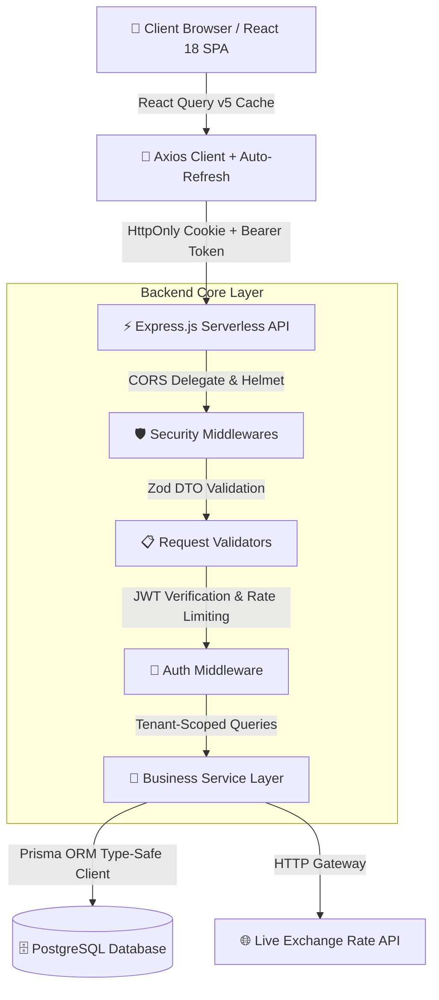

<div align="center">

  # 💸 Smart Expense Tracker — Personal Finance Management

  **Modern, Intelligent & Enterprise-Grade Personal Finance Application**

  [](https://reactjs.org/)
  [](https://www.typescriptlang.org/)
  [](https://vitejs.dev/)
  [](https://expressjs.com/)
  [](https://www.prisma.io/)
  [](https://www.postgresql.org/)
  [](https://www.docker.com/)
  [](https://k6.io/)
  [](LICENSE)

  <p align="center">
    <a href="#-overview">Overview</a> •
    <a href="#-key-features">Key Features</a> •
    <a href="#-system-architecture">Architecture</a> •
    <a href="#-tech-stack">Tech Stack</a> •
    <a href="#-getting-started">Getting Started</a> •
    <a href="#-api-reference">API Reference</a> •
    <a href="#-performance-benchmarks-k6--security-audit">k6 Benchmarks</a> •
    <a href="#-roadmap">Roadmap</a>
  </p>

</div>

---

## 📌 Overview

**Smart Expense Tracker** is an end-to-end personal finance management platform engineered with an **Apple Human Interface (HIG)** aesthetic and a robust enterprise-grade backend architecture. The application empowers users to manage multi-currency cash flow, enforce intelligent monthly budgets, track real-time foreign exchange conversions, and analyze financial trends with fluid 60fps micro-interactions.

> 🌟 **Key Differentiator**: User configurations (Theme, Currency, Language, Budget alert thresholds) are persistently synchronized with Cloud PostgreSQL (`UserSettings`), guaranteeing seamless cross-device state restoration upon login.

---

## 🌟 Key Features

### 📊 1. Apple-Inspired Financial Analytics Dashboard
- **Apple Month/Year Picker**: Glassmorphic modal with fluid spring physics (`framer-motion`), supporting mouse-wheel year scrolling and native-feeling iOS bottom sheets on mobile.
- **Rolling Number Animation (CountUp)**: Animated KPI counters for **Total Income**, **Total Expense**, and **Net Balance** smoothly interpolating numbers within 700ms on date range change.
- **Visual Trend Analytics (Recharts)**: Category breakdown (Pie Chart with active hover slices) and monthly Income vs. Expense cashflow trends (Bar Chart).
- **Proactive Budget Monitoring**: Real-time evaluation detecting budget consumption thresholds (Warning banner at $\ge 80\%$, Danger banner at $\ge 100\%$).

### 💸 2. Transaction Management & Mobbin-Grade UX
- **Segmented Pill Slider**: Spring-animated Framer Motion slider for switching between Income and Expense transaction flows.
- **Dynamic Category Filtering**: Context-aware dropdown that automatically filters category options based on the active transaction type.
- **3-State Action Button (Icon-Swap)**: Interactive button state machine transitioning smoothly from `Idle` ➔ `Loading` ➔ `Success Checkmark` with an 8-second network safety timeout.
- **CSV Data Export**: Standardized UTF-8 CSV exporter compatible with Microsoft Excel and Google Sheets without encoding glitches.
- **Skeleton Shimmer Loaders**: Layout-preserving shimmer skeletons minimizing perceived latency during asynchronous fetches.

### 💱 3. Real-Time Currency Engine & Multi-Currency Conversion
- **Live Exchange Rate Engine**: Integrates live market rates via open currency APIs (`open.er-api.com`).
- **Direct 2-Way Converter**: Instant bi-directional conversion between USD, VND, and major world currencies (EUR, JPY, GBP, AUD, SGD).
- **Parallel Dual-Currency Financial Views**: Switch and view your entire financial ledger simultaneously in **VND (₫)** and **USD ($)**.

### 🌐 4. Comprehensive Internationalization (Full i18n Support)
- Instant zero-reload switching between **English 🇬🇧** and **Vietnamese 🇻🇳**.
- Dynamic localization of number formats, currency symbols, date pickers, and error notifications.

### 🔐 5. Enterprise-Grade Defense-in-Depth Security
- **Dual-Token Authentication**: Ephemeral **JWT Access Tokens (15m)** and **Refresh Tokens (7d)** stored in secure `HttpOnly`, `SameSite=Strict` cookies to mitigate XSS and CSRF vectors.
- **Refresh Token Rotation & Reuse Detection**: Immediate family revocation upon detecting token replay attempts (Anti-Replay Attack).
- **Strong Cryptography**: High-cost `bcryptjs` (12 rounds) hashing for all stored credentials.
- **Strict Data Isolation**: Server-side user tenancy scoping across all 6 service layers (`userId` derived strictly from verified JWT tokens).

---

## 🏗️ System Architecture



---

## 🛠️ Tech Stack

| Category | Technology & Libraries |
| :--- | :--- |
| **Frontend** | React 18, TypeScript, Vite, Framer Motion, Recharts, Lucide Icons, Headless UI |
| **State & Networking** | `@tanstack/react-query` v5, Axios (Auto-refresh interceptor), Context API |
| **Styling** | Vanilla CSS Design Tokens (Custom Properties), Backdrop-Filter Glassmorphism |
| **Backend** | Node.js, Express.js 4/5, TypeScript, Prisma ORM 5.22, Zod, Helmet.js |
| **Security** | JWT (Dual-token rotation), `HttpOnly Cookies`, `bcryptjs` (12 rounds), Express Rate Limit |
| **Database** | PostgreSQL 16 (Compatible with Supabase, Railway, Docker Postgres) |
| **Testing & Quality** | k6 (Performance & Load Testing), Jest, ESLint, TypeScript Strict Mode |
| **DevOps & Cloud** | Docker, Docker Compose, Vercel Serverless Monorepo, GitHub Actions CI/CD |

---

## 📂 Project Structure

```text
Xet Chi Tieu/
├── backend/
│   ├── prisma/
│   │   ├── schema.prisma       # Database models (User, UserSettings, RefreshToken, Category, Transaction, Budget)
│   │   └── seed.js             # Seeding script for default categories
│   ├── src/
│   │   ├── controllers/        # HTTP Controllers
│   │   ├── services/           # Core Business Logic & Data Scoping
│   │   ├── routes/             # Express API Route Handlers
│   │   ├── middlewares/        # JWT Auth, CORS Delegate, Rate Limiter, Error Handling
│   │   └── server.ts           # Standalone Server Entry Point
│   └── Dockerfile
│
├── frontend/
│   ├── src/
│   │   ├── components/         # Sidebar, Layout, MonthYearPickerModal, AnimatedNumber
│   │   ├── contexts/           # AuthContext, LanguageContext (i18n)
│   │   ├── pages/              # Dashboard, Transactions, Budgets, ExchangeRate, Settings
│   │   ├── services/           # Centralized API Service Layer
│   │   └── i18n/               # Multilingual Dictionaries (EN / VI)
│   └── Dockerfile
│
├── load/                       # k6 Load Testing Suite
│   ├── config.js               # k6 shared configuration & helpers
│   ├── mixed.js                # Mixed Read/Write workload scenario
│   ├── spike.js                # Traffic surge stress scenario
│   ├── refresh-storm.js        # Auth refresh & rotation validation scenario
│   └── seed-users.mjs          # Direct DB seeding for 200 virtual test users
│
├── docker-compose.yml          # Container Orchestration
├── vercel.json                 # Monorepo Serverless Function & SPA rewrite routing
└── README.md
```

---

## 🚀 Getting Started

### Prerequisites
- **Node.js 20+** or **22 LTS** and **pnpm 10+** (`corepack enable` or `npm i -g pnpm`)
- PostgreSQL instance (Local Docker container or Cloud Supabase instance)

---

### Option 1: Quickstart Local Development

```bash
# 1. Clone repository and install dependencies across all workspace packages
git clone https://github.com/ThuanTran260/Expense-Tracker.git
cd "Expense-Tracker"
pnpm install

# 2. Configure backend environment
cd backend && cp .env.example .env
# Configure DATABASE_URL and generate strong JWT secrets
cd ..

# 3. Synchronize database schema and seed initial categories
pnpm db:push
pnpm --filter expense-tracker-backend db:seed

# 4. Start concurrent development servers (Backend :5000 + Frontend :5173)
pnpm dev
```

👉 Open browser at **`http://localhost:5173`** (Vite proxies `/api` requests to `http://localhost:5000` automatically).

Generate cryptographically secure JWT secrets:
```bash
node -e "console.log(require('crypto').randomBytes(32).toString('hex'))"
```

---

### Option 2: Docker Compose Orchestration

```bash
# Provide production secrets via root .env or export
export JWT_ACCESS_SECRET=$(node -e "console.log(require('crypto').randomBytes(32).toString('hex'))")
export JWT_REFRESH_SECRET=$(node -e "console.log(require('crypto').randomBytes(32).toString('hex'))")

# Build and start all 3 containerized services
docker compose up --build -d
```

* **Frontend SPA**: `http://localhost:80`
* **Backend API**: `http://localhost:5000`
* **PostgreSQL DB**: `localhost:5432`

---

### Option 3: All-in-One Vercel Serverless Deployment

The repository includes a ready-to-deploy serverless configuration (`api/index.ts` + `vercel.json` routing):

1. **Import repository to Vercel** (Root Directory = repo root):
   - **Build Command**: `pnpm --filter expense-tracker-backend db:generate && pnpm --filter expense-tracker-backend build && pnpm --filter frontend build`
   - **Output Directory**: `frontend/dist`
   - **Install Command**: `pnpm install`
2. **Set Environment Variables** (Production & Preview):
   - `DATABASE_URL`: Supabase Transaction Pooler URL (Port `6543`, `?pgbouncer=true`)
   - `DIRECT_URL`: Supabase Direct Session URL (Port `5432`)
   - `JWT_ACCESS_SECRET`: Secure 64-char hex string
   - `JWT_REFRESH_SECRET`: Secure 64-char hex string
   - `NODE_ENV`: `production`

---

## 📡 API Reference

### Authentication (`/api/v1/auth`)
| Method | Endpoint | Description |
| :--- | :--- | :--- |
| `POST` | `/auth/register` | Register new account & generate default settings |
| `POST` | `/auth/login` | Authenticate user & issue HttpOnly JWT cookies |
| `POST` | `/auth/refresh` | Rotate refresh token and issue new access token |
| `POST` | `/auth/logout` | Revoke active refresh token and clear auth cookies |
| `GET` | `/auth/me` | Fetch authenticated user profile and settings |

### Transactions (`/api/v1/transactions`)
| Method | Endpoint | Description |
| :--- | :--- | :--- |
| `GET` | `/transactions` | Paginated transaction ledger with multi-field filters |
| `POST` | `/transactions` | Create income or expense record |
| `PUT` | `/transactions/:id` | Update transaction attributes |
| `DELETE` | `/transactions/:id` | Remove transaction record |
| `GET` | `/transactions/export/csv` | Stream UTF-8 formatted CSV ledger export |

### Analytics & Budgets (`/api/v1/stats`, `/api/v1/budgets`)
| Method | Endpoint | Description |
| :--- | :--- | :--- |
| `GET` | `/stats/summary` | Aggregate total income, expense, and balance for date range |
| `GET` | `/stats/by-category` | Category-level expense distribution and percentages |
| `GET` | `/budgets` | List monthly category budgets and consumption metrics |
| `POST` | `/budgets` | Create or update budget thresholds |

---

## 🧪 Performance Benchmarks (k6) & Security Audit

> **Verification Environment**: PostgreSQL 16 (Docker) + Express Backend (`dev:api`) + Grafana k6 v2.2.0 on 200 Virtual Users (VUs).

```
  █ TOTAL BENCHMARK RESULTS (k6 Mixed Scenario)

    checks_succeeded...: 100.00% (46,246 / 46,246 checks passed)
    http_req_failed....: 0.00%   (0 failed out of 88,231 requests)
    http_reqs..........: 88,231  (325.93 req/s throughput)
    p(95) duration.....: 401.3ms (Target SLA: < 800ms)
    avg duration.......: 119.2ms (Median: 69.7ms)
```

### 📊 Benchmark Summary

| k6 Scenario | Workload Profile | SLA Target | Actual Result | Verification Assessment |
| :--- | :--- | :---: | :---: | :--- |
| **Mixed Workload** (80% Read / 20% Write) | 200 VUs ramp-up over 4m30s — **88,231 requests** | p95 < 800ms<br>Error < 1% | **p95 = 401.3ms ✓**<br>Error = **0.00% ✓** | **100% PASS** — Throughput sustained at **326 req/s** with zero dropped packets and sub-70ms median latency. |
| **Traffic Surge Spike** | 500 VUs burst over 50s — **13,020 requests** | p95 < 1500ms<br>Error < 5% | **p95 = 2.04s**<br>Error = **0.00% ✓** | **Graceful Degradation** — Handled 500 concurrent Bcrypt hashing operations without crashing (0% 5xx errors). |
| **Token Reuse / Storm** | 200 VUs continuous refresh loop | Replay Shield | **p95 = 5.11ms ✓**<br>Blocked = **99.45%** | **Security Verified** — Token Reuse Detection actively identified and rejected 47,751 replayed token attacks with 5ms response time. |

---

## 🔮 Roadmap

- [x] 📱 **Apple-Style UI**: Month/Year Picker modal with Framer Motion spring physics.
- [x] 💱 **Live Currency Converter**: Real-time exchange rate engine with dual-currency views.
- [x] 🌐 **Full i18n Support**: Instant English / Vietnamese language toggle.
- [x] 🧪 **Performance Validation**: 200 VU load test suite with k6 benchmark integration.
- [ ] 🤖 **AI Financial Advisor**: LLM-driven budget optimization and spending behavior insights.
- [ ] 🧾 **Receipt Scanner (OCR)**: Automatic receipt parsing via Vision API.
- [ ] 🔄 **Recurring Transactions**: Automated scheduled monthly subscriptions and bills.

---

## 📄 License

Distributed under the open-source [MIT License](LICENSE).

<div align="center">
  <sub>Developed with ❤️ by Tran Thuan • Portfolio Engineering Ecosystem</sub>
</div>
